# 能力
[Slay.one](Slay-one.md) 中的能力是玩家分配点数的技能或被动加成。分配给一种能力的点数越多，它就越有效。玩家最多可以分配12能力点。

##  能力列表
### 主动能力
这些能力必须激活才能生效。一旦使用了某些技能，就会有一个冷却时间，阻止玩家使用该技能。玩家一次最多只能携带2个主动能力。主动能力需要一定能量才能使用。如果玩家没有足够的能量来激活它们，他们就无法激活所述能力。

| | 名称 | 描述 |
| :-------: | :-------: | :-------: |
|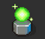| [治愈光环](Heal_Aura.md) | 创造一个光环，治愈附近的单位。 |
|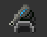| [激光炮塔](Laser_Turret.md) | 创建一个用激光射击敌方单位的炮塔。 |
|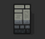| [墙](Wall.md) | 创建一堵墙，阻挡路径和发射物。不过，榴弹可以射过它。 |
|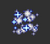| [传送](Teleport.md) | 在短距离内传送。传送过后，你不能在2秒内射击。 |
|| [酸性手榴弹](Acid_Grenade.md) | 投掷一枚酸性手榴弹，随着时间的推移会对单位和物体造成伤害。 |
|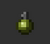| [手榴弹](HE_Grenade.md) | 投掷一枚爆炸的手榴弹，对敌方单位造成重大伤害。 |
|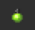| [激光手榴弹](Laser_Grenade.md) | 投掷一枚手榴弹，在爆炸时向各个方向发射反弹激光。 |
|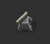| [导弹炮塔](Missile_Turret.md) | 创建一个用导弹射击敌方单位的炮塔。 |
|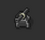| [榴弹炮塔](images/Grenade_Turret.md) | 创建一个用导弹射击敌方单位的炮塔。 |
|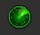| [扫描](Scan.md) | 暂时显示小地图上的所有单位。还增加了隐形玩家的可见度。 |
|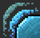| [护盾](Shield.md) | 将来袭伤害降低到10。只持续一秒钟。 |

### 被动能力
这些能力将在不需要激活的情况下提供加成。一次可以装备多少被动能力是没有限制的。

| | 名称 | 描述 | 费用 | 最高级别 |
| :-------: | :-------: | :-------: | :-------: | :-------: |
|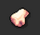| [生命值](Strength.md) | 将你的最大生命值提高 6.5。 | 100 | 10 |
|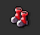| [移动速度](Agility.md) | 提高你的移动速度。 | 100 | 10 |
|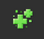| [生命恢复](Regeneration.md) | 提高你的生命值再生速率。 | 100 | 10 |
|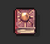| [能量恢复](Intelligence.md) | 提高你的能量值再生速率。 | 100 | 10 |
|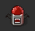| [生命偷取](Lifesteal.md) | 将你的最大生命值提高 6.5。 | 100 | 10 |

### 僵尸能力
这些能力只适用于在[感染模式](Infection.md)中作为[僵尸](Zombie.md)的玩家。

| | 名称 | 描述 | 能量 | 最高级别 | 费用 | 最大范围 | 需要等级 |
| :-----: | :-----: | :----: | :-----: | :-----: | :-----: | :-----: | :-----: |
|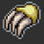| [伤害](Damage.md) | 增加你的伤害。 | 0 | 10 | 100 | - | - |
|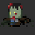| [召唤僵尸](SummonZombie.md) | 召唤一个普通僵尸。 | 40 | 5 | 100 | 5 | - |
|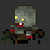| [召唤胖僵尸](SummonStrongerZombie.md) | 召唤一个胖僵尸。 | 50 | 5 | 100 | 5 | - |
|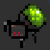| [召唤爆破者](SummonCrawler.md) | 召唤一个爆破者。 | 30 | 5 | 100 | 4 | 4 | 
|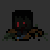| [召唤黑暗僵尸](SummonDarkZombie.md) | 召唤一个黑暗僵尸。 | 80 | 5 | 100 | 4 | 8 | 
|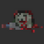| [装死](PlayDead.md) | 装死。 | 5 | 1 | 100 | - | - | 
|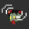| [僵尸感应](Zombie_Sence.md) | 显示你附近的隐形玩家。 | 0 | 3 | 100 | 5 | 4 | - |

### 移除的能力
请参见：[停用的功能](Retired_Features.md)

### 将推出的功能
这些能力将被添加到游戏中。

| | 名称 | 描述 |
| :----: | :----: | :----: |
| | 抓钩 | 这种能力可以抓住对手或抓住不可移动的方格并推动自己。 |
