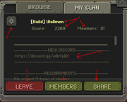
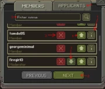

# 部落
**部落**是 [Slay.one](Slay-one.md) 的可选附属物。部落让玩家可以为社交活动创建群组，与朋友一起加入。其他玩家可能会使用部落进行竞争，并将其作为身份象征。一些部落有要求，通常以 [ELO](ELO.md) 或 KDR 的形式出现。
##  如何加入一个部落
1. 进到“部落”菜单
2. 找到你想加入的部落
3. 点击加入按钮
4. 写一段描述（你为什么想加入此部落）
5. 点击发送按钮
##  如何创建一个部落
1. 进到“部落”菜单
2. 进到“创建”部分
3. 填写部落信息：
    - 部落标签（以后不能更改）
    - 部落名称（以后不能更改）
    - 部落描述（以后可以更改）
4. 点击创建按钮（**你必须付1000金币**）
##  部落预览
{align=right}
**1. 部落信息**

- 部落的名称和标签
##  成员预览
{align=right}
**1. 玩家配置**

**2. 下一页**

**3. 踢出玩家**

**4. 提拔玩家：**成员-->版主-->管理员

**5. 搜索玩家**

**6. 申请人：**向部落申请的清单

**7. 降级玩家：**管理员-->版主-->成员

请参阅右图。图表标签指的是上面的数字。
##  部落职务
- **成员：**普通部落成员，没有任何权限
- **主持人：**可以接受和踢出玩家
- **管理员：**可以更改部落名称、成员职务和部落描述。管理员也可以解散部落。
**警告：***仅将部落职务授予可信赖的玩家。一个糟糕的版主可以将所有玩家踢出战队，一个糟糕的管理员可以移除你的管理员身份或解散部落！*

##    部落分数计算
- 分数算式：
    - 部落分数=(前10名elo的总和-24000)\*0.6+(前11~20名elo的总和-24000)\*0.3+(前21~30名elo的总和-24000)\*0.1

*注意：部落分数目前在slay.one中坏掉了并且不会更新。*