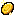
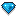
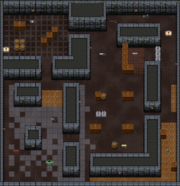

# 货币
在 [Slay.one](Slay-one.md) 中有不同种类的**货币**。

##  金币
金币是游戏里的主要货币。金币可以通过完成一次5分钟以上的游戏，升级或打开宝箱的方式得到。如果你直到游戏结束都留在里面并且在游戏里玩了5分钟或更多，你在游戏每玩一分钟，会得到1金币。升级和打开宝箱会得到更多的金币 - 更高等级和更高级的宝箱会提供更多的金币。

这种货币用来：
- 购买皮肤
- 创建游戏内比赛
- 建立新的部落

##  宝石
宝石是游戏中一种特殊的货币。宝石只能通过升级和在 steam 上购买获得。

这种货币用来：{align=right}

- 解锁皮肤