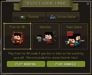
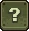
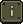
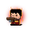
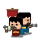
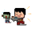

# 游戏模式
{align=right}
在[Slay.one](./Slay-one.md)中，有几种**游戏模式**:

##  如何加入游戏
- 点击“开始”按钮。
- 你可以选择一个存在的游戏或从弹出菜单中创建一个新的。

##  游戏模式
### FFA
-  [普通死亡竞赛](./Deathmatch.md)
  : 你与所有玩家战斗。 每次击杀你会得到 10-15 分，这取决于你击杀的玩家。 如果你死了，你会失去10-20分，这取决于你有多少分和你的敌人的分数。 在游戏结束时，得分最高的玩家获胜。
-  [排名死亡竞赛](./Ranked_Deathmatch.md)
  : 与普通死亡竞赛相同，但在排名死亡竞赛中，玩家为[ELO](./ELO.md)而战。 如果一名玩家死亡，他将失去ELO，如果他杀死一名玩家，他将获得ELO。
-  [僵尸死亡竞赛](./Zombie_Deathmatch.md)
  : 僵尸在地图中间生成。如果你杀死一个僵尸，你会得到灵魂。有了灵魂，你可以升级你的能力。如果你死了，你会失去一半的灵魂。拥有最多灵魂的玩家获胜。
-  [1v1](./1v1.md)
  : 这是目前游戏中最好的游戏模式之一，两名玩家在一个普通地图中互相战斗。
### 团队模式
-  [夺旗](./Capture_The_Flag.md)
  : 在夺旗模式下，有两支队伍（红/蓝）。每支队伍都有一面旗帜。你必须拿起另一支队的旗帜并将其带到你的队伍的旗帜上才能获得分数。得分多的队伍获胜。
-  [团队死亡竞赛](./Team_Deathmatch.md)
  : 你的团队必须获得更多击杀数量。在前30秒内，僵尸会在地图中间生成。拥有更多灵魂的团队获胜。
### 感染模式
-  [感染模式](./Infection.md)(在2017年4月发布)
  : 玩家必须生存。僵尸必须杀死所有玩家，幸存的玩家将赢得比赛。

##  即将到来的游戏模式
- PVE
  
  （目前不确定这个游戏模式是否会被发布）
   : 玩家必须防御基地，对抗僵尸。