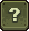

# 按键绑定
##  按键绑定
按键绑定（也称为键绑定）是一种手动将按键绑定到游戏中键或按钮控制的操作的方法。在武器之间切换时，键绑定非常有用，因为几个默认键远离玩家的键盘手，到了不舒适的地步。
### 如何更改按键绑定
{align=right}
转到 Slay.one 主菜单。单击菜单左上角的选项（齿轮按钮），然后单击“键盘操作方法”按钮。你应该会看到一个标签和按钮列表，其标题为“编辑快捷键”。例如，要想更改猎枪的键，先找到“猎枪”标签，然后单击其旁边的按钮。按钮上的字母应变为红色。然后按要绑定到猎枪的键。
##  默认按键绑定
以下是 Slay.one 中的默认按键及其效果。请注意，这些键在 AZERTY 键盘上将保持不变，因此你必须手动绑定它们。要查看这些按键，点按屏幕左上角的选项（齿轮按钮），然后按控制按钮。
### 默认键盘设置：
#### 移动：
W = 向上移动

S = 向下移动

A = 向左移动

D = 向右移动

右键 = 跳跃
#### 武器：
1 = 激光枪

2 = 榴弹发射器

3 = 火焰喷射器

4 = 急射小机枪

5 = 喷火器

6 = 激光枪-R

7 = 自动制导火箭发射器

8 = 远程控制火箭发射器

9 = 狙击步枪

0 = 霰弹枪

N = 快速火箭发射器

M = 快速榴弹发射器

H = 治愈光波

注意：能量狙击枪没有默认热键，但你可以指定一个。
#### 其它
左键单击 = 发射武器

Y = 发射次级能量步枪子弹（左键发射初级子弹）

R = 装载弹药（这会手动装载弹药，即使它没有空弹夹 - 例如，如果有一支带有 30 弹药的急射小机枪，可以按 R 装载弹药。）

F = 用狙击枪瞄准

Q = 使用第一个[技能](Abilities.md)槽

E = 使用第二个技能槽

空格键 = 选择升级（这仅适用于感染和团队死亡竞赛[游戏模式](Game_Modes.md)）

回车键 = 打开聊天栏。输入您的消息，然后再次按回车键发送。