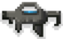
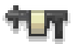
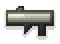
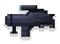
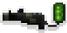

# 武器
[Slay.one](Slay-one.md) 中的**武器**是战斗中用来对敌人造成伤害的物品。每种武器都有自己的优点和缺点。武器作为[可捡起物品](Pickups.md)在地图上被发现。武器需要使用弹药。

有几种类型的武器。下表描述了它们的差异。

## 武器列表
| 枪支图片 | 武器 | 描述 | 最大伤害 | 最大范围 | 装填时间 | 射速 | 弹夹容量 | 移动速度系数 |
| :-----: | :-----: | :-----: | :-----: | :-----: | :-----: | :-----: | :-----: | :-----: |
|  | [激光枪](Laser_Gun.png) | 一种基本的激光枪 | 28 | 无限 | 1秒 | 0.85 | 无限 | 1 |
|  | [榴弹发射器](Grenade_Launcher.md) | 一种能发射爆炸榴弹的强大武器。榴弹可以越过像板条箱这样的小障碍物 | 60 | 9.5 | 2.75秒 | 0 | 1 | 1.03 |
|  | [喷火器](Flamethrower.md) | 一种可以快速杀死敌人的短程武器 | 40/秒 | 7.2 | 3秒 | 0 | 50 | 1.13 |
|  | [急射小机枪](Minigun.md) | 一种强有力的快速射击武器 | 5.55 | 无限 | 3秒 | 0.1 | 50 | 1 |
|  | [火箭发射器](Rocket_Launcher.md) | 一种发射爆炸火箭的强大武器 | 60 | 无限 | 2.75秒 | - | 1 | 1 |
|  | [激光枪R](Laser_Gun_R.md) | 被墙壁和障碍物反射的激光枪 | 28 | 有限 | 1秒 | 0.85 | 20 | 1 |
|  | [自动制导导弹发射器](Homing_Launcher.md) | 一种发射自动制导导弹的强大武器 | 50 | 有限 | 3.5秒 | - | 1 | 0.9 |
|  | [远程控制导弹发射器](Remote_Controlled_Launcher.md) | 一种发射跟随你的鼠标光标的制导导弹的强大武器 | 58 | 有限 |3.5秒 | - | 1 | 0.9 |
|  | [狙击步枪](Sniper_Rifle.md) | 有射程和杀伤力的狙击步枪。你需要先按住F瞄准，然后才能射击 | 65 | 10 | 3.5秒 | 1.75 | 5 | 1.1 |
|  | [猎枪](Shotgun.md) | 猎枪（霰弹枪）在你离目标越近时造成的伤害越大 | 49 | 10 | 2.75秒 | 1.1 | 5 | 1.05 |
|  | [快速火箭发射器](Rapid_Rocket_Launcher.md) | 高射速的火箭发射器 | 42 | 16 | 3秒 | 0.9 | 8 | 1.05 |
|  | [快速榴弹发射器](Rapid_Granade_Launcher.md) | 高射速的榴弹发射器。榴弹可以越过像板条箱这样的小障碍物 | 42 | 9.5 | 3秒 | 0.9 | 8 | 1.05 |
|  | [治愈光波](Heal_Beam.md) | 能治愈你和你的队友的武器 | 治愈：5/秒 | 无限 | 3.5秒 | 0 | 40 | 1.15 |
|  | [能量狙击枪](Energy_Rifle.md) | 一种发射激光光束的武器，可以帮助你瞄准敌人 | 20 | 无限 | 2秒 | 0.85 | 14 | 1 |
| | 僵尸近战 | 只有在感染模式下僵尸才能使用的近战攻击 | 30 | 0 | - | - | 无限 | 1 |